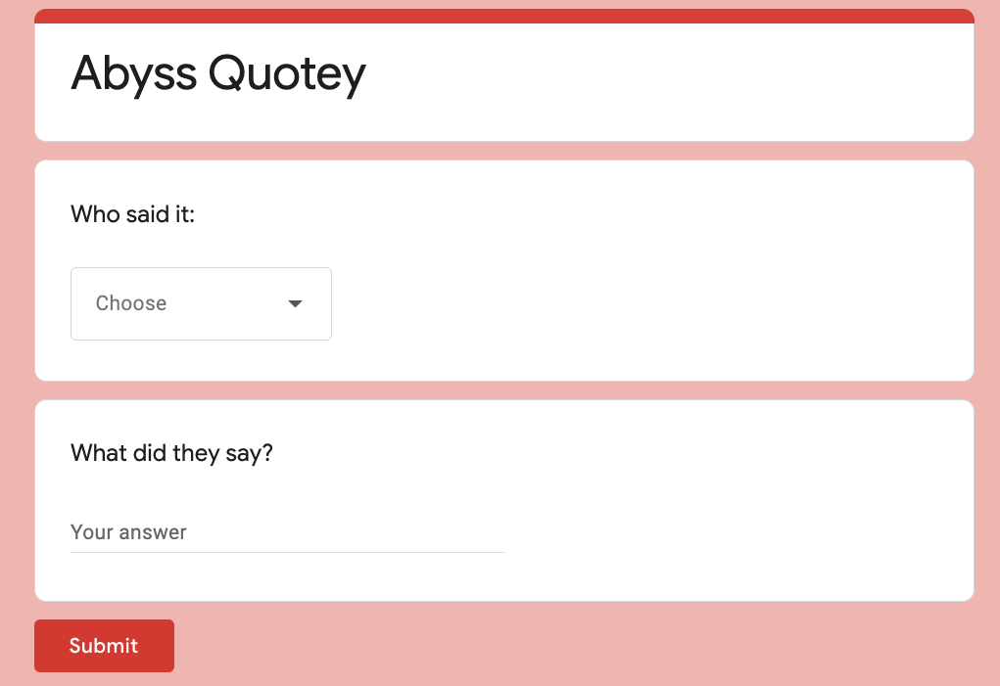
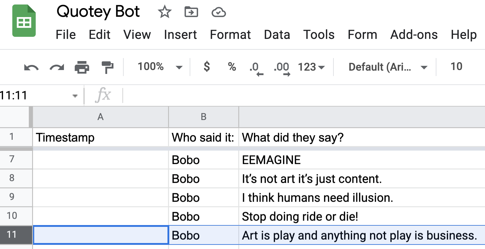
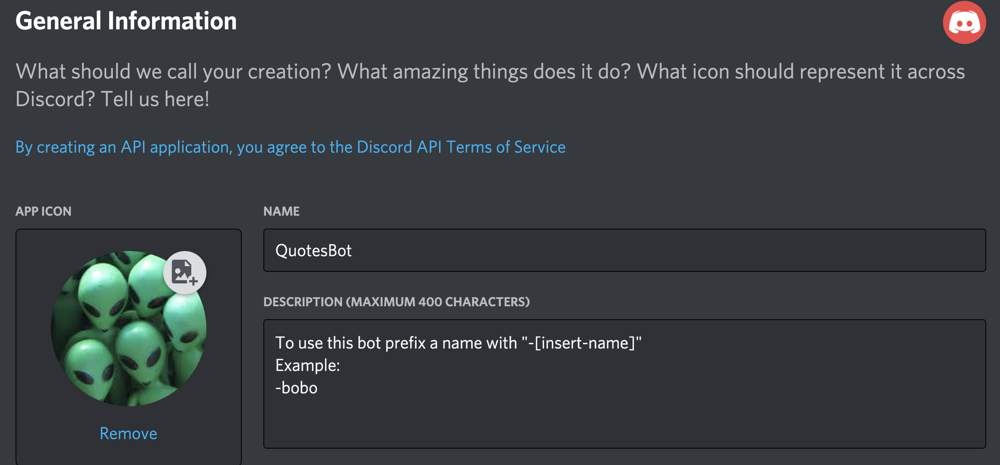

# The Abyss Quotes Bot

## What it is

A personalized Discord Bot for my friends.

## But why?

We had created a `#quotes` channel where we saved one anothers funny or insightful quotes. Which was great, but I wanted a way to integrate the quotes in a more interactive way.

And this was the outcome:

The user types in "-" + the name of the person they're wanting to quote and voila, you get a random quote. 🎉

This was all well and good but then I started to get sick of having to copy and paste the quotes myself. And as much as I loved my friends, I wasn't up for continuing the unpaid labor. So I decided to use a google form that they could fill out to enter the quote.

Google generates a spreadsheet.

The code then read from the spreadsheet to generate a random quote.

I didn't want to have to have it on my personal computer every time I wanted to run it so I hosted it on Heroku so it will always run when someone types in the prompt in Discord.

## API's used

- [Google Sheets for Developers API](https://developers.google.com/sheets/api/)
- [Discord.js](https://discord.js.org/?source=post_page---------------------------#/)
  

## Getting Started

If wanting for personal use, you'll need to run through the Google Sheets for Developers quickstart guide, swap out the spreadsheet link, enter your personal discord bot credentials, google api credentials, and discord token.

To start, in the terminal run:

`$ node .`

## Things I Learned

- How to use the [dotenv](https://www.npmjs.com/package/dotenv) properly.
- Working with Google sheets API
- Working with Discord bots
- How to deploy to Heroku. This [tutorial](https://www.studytonight.com/post/how-to-deploy-a-discord-bot-to-heroku) was really helpful in understanding that I needing to change the resource and profile to `worker`
